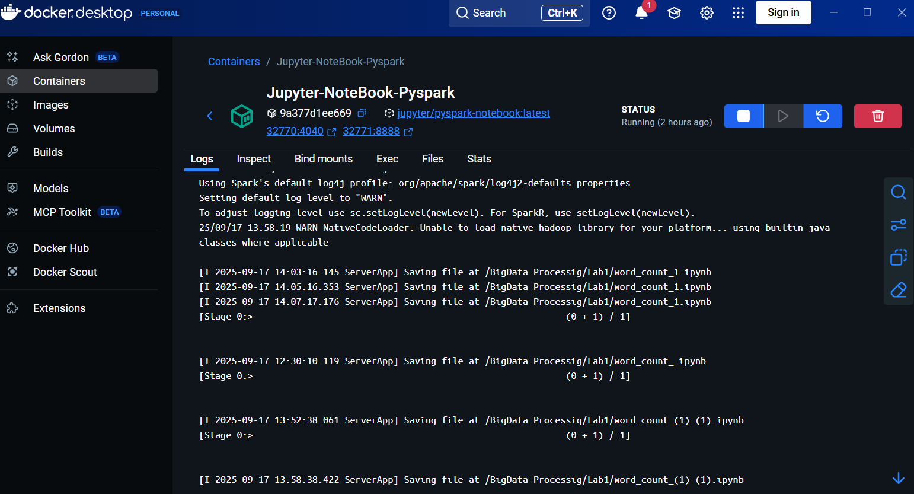
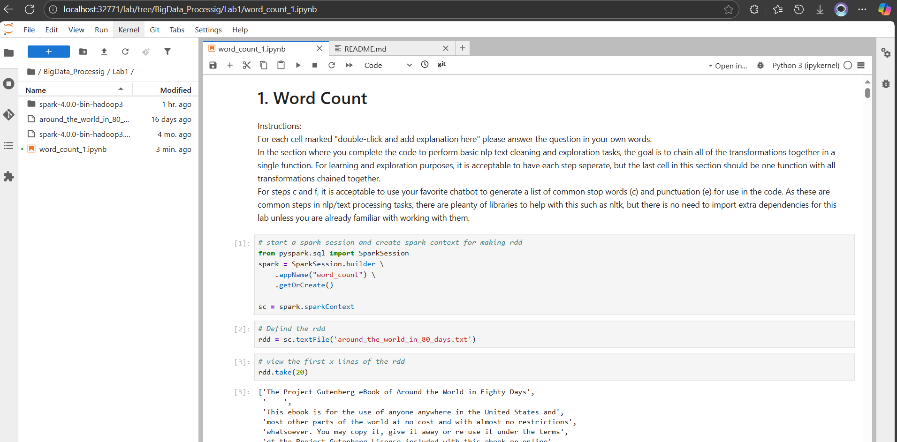

# LAB 1 BIG DATA PROCESSING

## Authors : 
- Sacha FRANCFORT
- Masao COUDEVILLE
- Corentin GAUDE
- Noé BRANDOLINI

## Our note_book is called ```word_count_1.ipynb```

### We have made this lab on a image Docker for Spark and Jupyter.

Docker Image Running :


Jupyter Notebook running on Docker Image :

